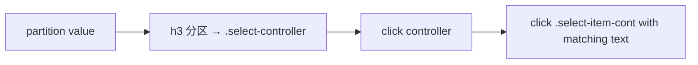

# Bilibili 分区 dropdown

## Job field

`bilibili.partition`: string (e.g. `"vlog"`)

## Workflow

```mermaid
flowchart LR
  Job["partition value"] --> Find["h3 分区 → .select-controller"]
  Find --> Open["click controller"]
  Open --> Pick["click .select-item-cont with matching text"]
```
