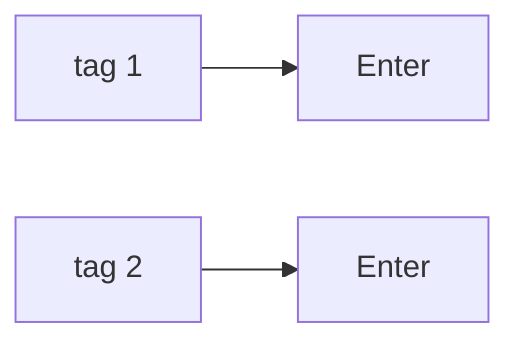

# Bilibili tags (Enter per tag)

## Change

`bilibili.tags[]` → for each tag: focus input → set value → dispatch Enter (Bilibili adds one chip per Enter).

## Workflow

```mermaid
flowchart LR
  T1["tag 1"] --> Enter1["Enter"]
  T2["tag 2"] --> Enter2["Enter"]
```
